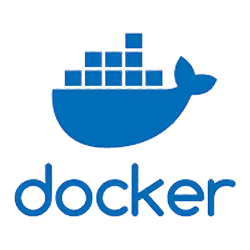

## Introdução

Este documento apresenta as principais tecnologias selecionadas para o desenvolvimento do sistema **Sexto Andar**. A escolha dessas tecnologias foi baseada em critérios como performance, escalabilidade, facilidade de manutenção e suporte da comunidade.

O projeto utiliza uma arquitetura moderna separando claramente as responsabilidades entre **backend** (API REST), **frontend** (interface de usuário), **banco de dados** (persistência) e **infraestrutura** (deployment e gerenciamento).

Cada tecnologia foi cuidadosamente avaliada para garantir a melhor experiência tanto para desenvolvedores quanto para usuários finais, priorizando ferramentas maduras e amplamente adotadas no mercado.

## Backend

<table>
    <thread>
        <tr>
            <th>Tecnologia</th>
            <th>Imagem</th>
            <th>Descrição</th>
        </tr>
    </thread>
    <tbody>
        <tr>
            <td>Fastapi</td>
            <td>
                
            </td>
            <td>Framework web moderno e de alta performance para construção de APIs com Python. Oferece validação automática de dados, documentação interativa automática (Swagger/OpenAPI) e suporte nativo para programação assíncrona.</td>
        </tr>
        <tr>
            <td>SQLAlchemy</td>
            <td>
                
            </td>
            <td>ORM (Object-Relational Mapping) Python que facilita a interação com bancos de dados relacionais. Oferece mapeamento automático entre objetos Python e tabelas de banco, query builder, migrations e suporte a múltiplos SGBDs.</td>
        </tr>
        <tr>
        </tr>
    </tbody>
</table>

## Frontend

<table>
    <thread>
        <tr>
            <th>Tecnologia</th>
            <th>Imagem</th>
            <th>Descrição</th>
        </tr>
    </thread>
    <tbody>
        <tr>
            <td>React</td>
            <td>
                
            </td>
            <td>Biblioteca JavaScript para construção de interfaces de usuário interativas. Baseada em componentes reutilizáveis, oferece um virtual DOM para alta performance, gerenciamento de estado eficiente e um ecossistema rico de ferramentas e bibliotecas.</td>
        </tr>
        <tr>
        </tr>
    </tbody>
</table>

## Banco de Dados

<table>
    <thread>
        <tr>
            <th>Tecnologia</th>
            <th>Imagem</th>
            <th>Descrição</th>
        </tr>
    </thread>
    <tbody>
        <tr>
            <td>PostgreSQL</td>
            <td>
                
            </td>
            <td>Sistema de gerenciamento de banco de dados relacional de código aberto. Oferece conformidade com padrões SQL, suporte a transações ACID, recursos avançados como índices, views materializadas e extensibilidade através de funções customizadas.</td>
        </tr>
        <tr>
        </tr>
    </tbody>
</table>

## Infraestrutura

<table>
    <thread>
        <tr>
            <th>Tecnologia</th>
            <th>Imagem</th>
            <th>Descrição</th>
        </tr>
    </thread>
    <tbody>
        <tr>
            <td>Docker</td>
            <td>
                
            </td>
            <td>Plataforma de containerização que permite empacotar aplicações e suas dependências em containers leves e portáveis. Facilita o deployment, escalabilidade e garante consistência entre ambientes de desenvolvimento, teste e produção.</td>
        </tr>
        <tr>
            <td>pgAdmin</td>
            <td>
                
            </td>
            <td>Ferramenta de administração e gerenciamento web para PostgreSQL. Oferece interface gráfica intuitiva para executar consultas SQL, gerenciar usuários, monitorar performance, criar backups e administrar bancos de dados PostgreSQL de forma visual.</td>
        </tr>
    </tbody>
</table>

